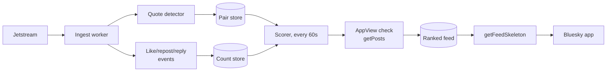

# Upstaged — AT Protocol Feed Generator Spec

2026-09-17 · @Nico Santini

A custom Bluesky feed that surfaces quote posts that out-engaged the post they quoted. Scope is set to popular posts only (a like threshold gate on either side), and the winning rule is a weighted composite of likes, reposts and replies.

## What the feed shows

One item: a quote post whose engagement beat the post it quoted, ranked by how badly it beat it.

**The upstage rule.** Post `O` is quoted by post `Q` when `Q` embeds `O` through `app.bsky.embed.record` or `app.bsky.embed.recordWithMedia`. `Q` is an upstage when `score(Q) > margin x score(O)` and at least one of them clears a popularity floor. Both scores are the weighted composite defined below.

**What a reader sees.** Nothing custom. A feed generator returns post URIs only, so the Bluesky client renders `Q` as an ordinary post card with `O` embedded inside it. That happens to be the perfect shape for this feed: the quote on top, the original quoted underneath, in one card. No client work, no fork of the app.

**What it is not.** Not a ratio detector (replies beating likes on a single post). Not a most-quoted leaderboard. Not a reply-guy feed: only quote posts count, because a quote is the deliberate, public, screenshot-shaped version of the move.

**Known limitation of the format.** `getFeedSkeleton` carries no room for an annotation, so the feed cannot show "3.4x the original" on the card. `feedContext` (a string the skeleton may attach per item) rides along to the client but is used for analytics and feedback, not display. If the multiplier has to be visible, it belongs in a companion web page, not in the feed.

## AT Protocol surface

Everything needed already exists in the public lexicons. Nothing here requires a private API or a Bluesky partnership.

| Lexicon | Direction | What it gives you |
| --- | --- | --- |
| [`network.bsky.jetstream.subscribeEvents`](https://bsky.network/docs/jetstream/) | consume (websocket) | Filtered JSON event stream. One subscription takes up to 100 collections and 10,000 DIDs; params are `collections`, `dids`, `kinds`, `cursor` |
| [`com.atproto.sync.subscribeRepos`](https://docs.bsky.app/docs/advanced-guides/firehose) | consume (websocket) | The raw firehose: CBOR + CAR blocks, cryptographically signed. Only worth it if you need self-authenticating data |
| `app.bsky.feed.post` | consume (record) | The post itself, and the `embed` that makes it a quote |
| `app.bsky.feed.like` / `app.bsky.feed.repost` | consume (record) | `subject.uri` names the post being liked or reposted — your own counters |
| [`app.bsky.feed.getPosts`](https://endpoints.bsky.app/) | read (HTTP) | Authoritative `likeCount`, `repostCount`, `replyCount`, `quoteCount`, `bookmarkCount` per post. Batched, 25 URIs per call |
| `app.bsky.feed.getQuotes` | read (HTTP) | Every quote of a given post — the backfill path for an original you discovered late |
| [`app.bsky.feed.getFeedSkeleton`](https://github.com/bluesky-social/feed-generator) | serve (HTTP) | The one endpoint you must implement |
| `app.bsky.feed.describeFeedGenerator` | serve (HTTP) | Declares which feeds this service hosts |
| `app.bsky.feed.generator` | publish (record) | The record in your own repo that makes the feed appear in the app |

**Detecting a quote.** In an `app.bsky.feed.post` record, read `embed.$type`:

- `app.bsky.embed.record` → quoted subject at `embed.record.uri`
- `app.bsky.embed.recordWithMedia` → quoted subject at `embed.record.record.uri`

Both can point at things that are not posts — a list, a starter pack, another feed generator — so require the AT-URI's collection segment to be `app.bsky.feed.post` before doing anything else. This single check discards a meaningful slice of the embed traffic for free.

**One caveat on Jetstream.** Its events carry no signatures or Merkle proofs, so the data is not self-authenticating. For a feed that ranks posts by engagement that is fine. If this ever grew into moderation or research tooling, it would need `subscribeRepos` instead.

## Architecture

Five stages, two of them cheap and always-on, three of them doing work only for pairs that already look promising.



The ingest worker does one job per event and never queries anything. A post with a post-embed becomes a row in the pair store; a like, repost or reply increments a counter keyed by the post it targets. Both writes are O(1) and need no knowledge of whether the target is interesting yet.

**The two-stage gate is the whole trick.** Counting every like on the network is the expensive path and the one to avoid. Instead the count store is *write-on-demand*: a counter row is created only when that post URI is already in the pair store, on either side of a pair. Everything else is dropped at the edge. That turns a firehose-wide problem into one bounded by how many quote posts exist, which is a small fraction of traffic.

The scorer wakes on a timer, reads pairs whose counters moved since the last pass, applies the composite score, and promotes anything over the margin. Before a pair enters the ranked feed it is checked once against `getPosts`, which returns the App View's authoritative counts. That check corrects for everything the local counters missed — engagement that landed before the pair was known, likes from repos your relay did not carry, deletions already reconciled upstream.

The serving path touches none of this. `getFeedSkeleton` reads one pre-ranked, pre-paginated list and returns URIs. It should be a cache read, never a query across the count store.

## The upstage score

Engagement for any post `p`:

```
E(p) = likes(p) + Wr * reposts(p) + Wc * replies(p)
```

The upstage ratio for a pair, with additive smoothing so a quote of a near-dead post cannot score infinity:

```
D = E(Q) / (E(O) + k)
```

A pair enters the feed when `max(E(O), E(Q)) >= P` and `D >= M`. Ranking inside the feed favours big upstages over lopsided small ones, and decays with age:

```
rank = D * log10(1 + E(Q)) / (age_hours + 2) ^ 1.5
```

| Constant | Default | What moving it does |
| --- | --- | --- |
| `Wr` repost weight | 2.0 | Reposts are the strongest amplification signal and the hardest to fake. Raise it to favour upstages that spread |
| `Wc` reply weight | 0.5 | Deliberately low. Replies are the noisiest signal, and a post being upstaged collects replies *because* it is being upstaged |
| `k` smoothing | 5 | Kills the "8 likes beats 1 like" false positive. Raise it if the feed fills with obscure pairs |
| `P` popularity floor | 50 | The scope gate. Nothing enters the pipeline until one side of the pair clears this |
| `M` upstage margin | 1.25 | 1.0 means any win counts. 1.25 means the quote must beat the original by a quarter |
| `age_hours` cap | 48 | Pairs stop being reconsidered after two days, matching the firehose retention Bluesky's own guidance assumes |

**The reply-weight trap is worth naming.** A viral upstage drives traffic back to the original post, so the original's reply count climbs alongside the quote's. Weighting replies heavily therefore makes the exact posts this feed is for *harder* to qualify, because the denominator grows with the numerator. `Wc = 0.5` keeps replies as a tiebreak rather than a driver. Setting `Wc = 0` is a defensible first version.

**Expect to retune `P` and `M` together.** They interact: a high floor with a low margin gives a feed of big accounts mildly outperforming each other, which is boring. A low floor with a high margin gives spectacular ratios between accounts nobody has heard of. The interesting band is a moderate floor and a margin well above 1.0, and the only way to find it is to run the scorer against a day of real pairs and read the output by hand.

## Data model

Four tables. Postgres handles all of it at this scale; Redis is worth adding only for the serving cache.

| Table | Key | Columns | Retention |
| --- | --- | --- | --- |
| `pairs` | `quote_uri` | `quote_did`, `quote_cid`, `original_uri`, `original_did`, `quoted_at`, `first_seen_at`, `state` | 48h if never promoted, 7d once promoted |
| `counts` | `post_uri` | `likes`, `reposts`, `replies`, `last_event_at`, `verified_at`, `verified_at_rev` | Follows the pair that created it |
| `feed` | `(score_desc, quote_cid)` | `quote_uri`, `score`, `ratio`, `computed_at` | Rebuilt each scorer pass, 7d window |
| `cursor` | singleton | Jetstream `cursor` (time in microseconds) | Checkpointed every few seconds |

**`counts` rows are created lazily.** The ingest worker looks up the target URI in `pairs` before touching `counts`; a miss is a no-op. This is the mechanism behind the popularity gate, so the lookup must be an in-process cache of recent pair URIs, not a database round trip per like event.

**Deletes decrement.** A Jetstream event with `operation: "delete"` on a like or repost reduces the counter; a delete on a post removes its pair and evicts it from the feed. Ignoring deletes leaves the feed showing upstages of posts that no longer exist, which is both wrong and a moderation liability.

**Local counts are an index, not the truth.** They exist to decide which of the millions of pairs deserve an App View call. A pair is only ever promoted on `getPosts` numbers, and `verified_at` records when that happened so the scorer can re-verify a stale leader rather than trust a counter that has been drifting for six hours.

**Cursors must be unique per item.** Bluesky's own guidance is explicit about this, and a score-only cursor breaks the moment two pairs tie. Use `score:quote_cid`, base64'd — the CID breaks ties and the pair is stable across a rebuild.

**Restart behaviour.** Jetstream replays from a microsecond cursor, so checkpointing lets an ingest worker restart without a gap. The replay window is finite, though; a worker down for hours should resume from the current head and let the next `getPosts` verification pass repair the counts it missed, rather than trying to catch up event by event.

## Serving contract

Three HTTPS routes on port 443 and one record in your own repo. That is the entire public surface.

**`GET /.well-known/did.json`** — the `did:web` document for `did:web:<your-hostname>`, carrying a service entry of type `BskyFeedGenerator` whose `serviceEndpoint` is your origin. `did:plc` works too, but `did:web` needs no PLC operation and is the path the starter kit takes.

**`GET /xrpc/app.bsky.feed.describeFeedGenerator`** — returns `{ did, feeds: [{ uri }] }`, declaring which feed at-URIs this service answers for.

**`GET /xrpc/app.bsky.feed.getFeedSkeleton`** — the real one.

| Field | Type | Notes |
| --- | --- | --- |
| `feed` (param) | at-uri, required | Which feed is being asked for; return `UnknownFeed` if it is not yours |
| `limit` (param) | int 1–100, default 50 |  |
| `cursor` (param) | string | Opaque; yours to define |
| `feed` (out) | array of `skeletonFeedPost` | Each item is `{ post: at-uri, reason?, feedContext? }`; `feedContext` caps at 2,000 chars |
| `cursor` (out) | string | Omit to signal the end of the feed |
| `reqId` (out) | string, max 100 | Per-request id echoed back with interaction events |

**Auth is optional here, and that is a feature.** A request may carry a service JWT signed by the viewer's repo key, with `iss` = viewer DID, `aud` = your feed's DID, and an `exp`. Validate it only if the feed personalises. This one does not, so it can serve unauthenticated and cache aggressively.

**You do not filter for blocks, mutes or labels.** The App View hydrates your URIs and applies the viewer's own moderation state before anything reaches their screen. Replicating that logic would be both wasted work and wrong, since you do not have the viewer's block list.

**Publishing.** Write an `app.bsky.feed.generator` record into your account's repo: the service DID, `displayName`, `description`, an avatar blob, `createdAt`. Its at-URI — `at://<your-did>/app.bsky.feed.generator/<rkey>` — *is* the feed's public identity, so pick the rkey deliberately; it ends up in the share URL.

**Latency is a product constraint.** The App View calls this synchronously every time someone opens the feed. Budget a p99 under 300 ms and serve from a materialised list, never from a live aggregation.

## Scale and cost

This runs on one small machine. The ingest path is a parse and a hash lookup per event, and the read path is a cache hit.

| Stream | Volume per day | Source |
| --- | --- | --- |
| Full firehose, pre-surge baseline | \~24 GB | [Jaz, Sept 2024](https://jazco.dev/2024/09/24/jetstream/) |
| Full firehose, Brazil-surge peak | \~232 GB | same |
| Jetstream, uncompressed, all collections | \~41 GB | same |
| Jetstream, zstd, posts only | \~850 MB | same |

Those are 2024 measurements and the network has grown since — roughly 40 million registered accounts and 3.5 million daily actives as of the [most recent published figures](https://backlinko.com/bluesky-statistics) (late 2025). Treat them as the right order of magnitude, not a budget. Re-measure by connecting to Jetstream for an hour before sizing anything.

**Subscribe to three collections, not one.** Posts, likes and reposts. Likes are the highest-volume collection on the network by a wide margin, several times post volume, so the compressed feed for all three sits well above the 850 MB/day posts-only figure. Plan for single-digit gigabytes a day compressed, and turn on zstd — the average event drops from 482 to 211 bytes.

**Jetstream's own limits are generous**: 100 collections and 10,000 DIDs per subscription. This design uses three collections and no DID filter, so neither binds.

**App View calls are the cheap part.** `getPosts` batches 25 URIs. Verifying ten thousand pairs an hour is four hundred calls an hour. Bluesky publishes no hard number for the public App View — the [rate-limit docs](https://bsky.network/docs/rate-limits/) say the limits are "generous" and to get in touch if you hit them — while an authenticated PDS-routed client is capped at 3,000 requests per 5 minutes per IP. Either way this workload is nowhere near.

**The real cost is retention, not throughput.** Pairs and counters are small rows, but they accumulate fast if nothing expires them. The 48-hour window on unpromoted pairs is what keeps the working set in memory-sized territory; drop it and the count store becomes the whole problem.

A VM with two cores and 4 GB, plus a managed Postgres, is enough to start. Write the ingest worker in Go or Rust if you want to stop thinking about it; Node will do it, but the per-event allocation cost is the thing that bites first.

## Edge cases, gaming and the pile-on problem

**Hard exclusions, applied at ingest:**

- `quote_did == original_did`. Quoting yourself is a thread continuation, not an upstage.
- The embed target is not an `app.bsky.feed.post`.
- Either side deleted. Watch `operation: "delete"` and evict.
- **Detached quotes.** An author can publish an `app.bsky.feed.postgate` record listing up to 50 `detachedEmbeddingUris` — quotes of their post they have pulled the rug on — or an `embeddingRules` entry of `disableRule` that blocks quoting outright. Subscribe to `app.bsky.feed.postgate` as a fourth collection and drop any pair whose quote URI is named there. Showing a quote its subject explicitly detached is the single worst thing this feed could do.
- Blocks between the two accounts. The App View will not hydrate the embed, so the card renders as a stub. On verification, if the quote's `embed` comes back as a detached or blocked view, drop the pair.

**Quote chains.** `Q` quotes `Q'` which quotes `O`. Score each pair against its immediate parent only. Comparing a third-order upstage against the root produces impressive ratios and incoherent cards.

**Gaming.** The popularity floor and the `k` smoothing kill the obvious attack — quote a dead post, get eight likes, top the feed. Two caps handle the rest: at most one pair per quoting DID in any 50-item page, and at most one pair per *original* author per day. Without the first, one prolific poster owns the feed. Without the second, the feed becomes a single person's worst afternoon, rendered fifty times.

**Now the part worth deciding before writing code.** A feed that ranks people by how thoroughly they were upstaged is, structurally, a pile-on amplifier. It finds the moment someone is being publicly bettered and puts it in front of an audience that came specifically for that. That is funny when the target is a brand account or a politician and ugly when it is a stranger with 200 followers.

Three guards, in order of how much they matter:

1. **A follower floor on the original author.** If the person being upstaged has fewer than a few thousand followers, the pair does not qualify. This is the punching-down filter and it is the one that does the work. It also happens to improve the feed, because upstages of nobodies are not funny.
2. **Drop pairs whose original author is deactivated, deleted or taken down.** If they left, the feed should stop.
3. **Apply labels yourself.** The App View filters for each viewer's own labeler subscriptions, but content labelled by Bluesky's moderation service will still reach viewers who have not subscribed to the relevant labeler. Subscribe to the labeler and drop labelled pairs at the source rather than relying on downstream filtering.

None of this is required to ship. All of it is much harder to retrofit once the feed has an audience.

## Build phases

The risky assumption is not the infrastructure — the starter kit handles most of that. It is whether the score actually finds funny posts. Test that first, with no infrastructure at all.

| Phase | What ships | What it proves | Rough effort |
| --- | --- | --- | --- |
| 0. Score validation | A notebook. Seed 50 heavily-quoted posts, pull their quotes with `getQuotes`, pull counts with `getPosts`, run the formula, read the top 30 by hand | Whether the feed is funny. Kill it here if not | 1 day |
| 1. Ingest only | Jetstream consumer, `pairs` / `counts` / postgate handling, scorer writing candidates to a log file. No HTTP | Real volume, real gate hit-rate, real tuning data | 2–3 days |
| 2. Serve | `did.json`, `describeFeedGenerator`, `getFeedSkeleton`, and the `app.bsky.feed.generator` record. Feed is live in the app | The whole loop, end to end | 1–2 days |
| 3. Guards | Follower floor, per-author caps, labeler subscription, block and detach handling | That it is safe to share | 2 days |
| 4. Tune | Re-fit `P`, `M` and the weights against a week of logged pairs | That it stays good | ongoing |

**Phase 0 is not a formality.** The formula in this spec is a reasoned guess. The odds it is right on the first try are low, and finding out costs one afternoon with no consumer, no database and no deployment. Everything after it is well-trodden ground.

**One thing to set up in phase 2 rather than later.** The `app.bsky.feed.generator` record carries `acceptsInteractions`. Turn it on, and the app will send interaction events — likes, clicks, shows — back to your service, which is the only real signal you will get about which pairs land. Retrofitting it means editing a published record, which is fine but easy to forget.

**Start from the [official starter kit](https://github.com/bluesky-social/feed-generator).** It is TypeScript, it already does the firehose subscription, the DID document, the skeleton endpoint and the publish script. Even if the ingest worker ends up in another language, the serving half is a solved problem you should not re-solve.

## Sources

- [ATProto Feed Generator starter kit](https://github.com/bluesky-social/feed-generator) — required endpoints, DID document, JWT auth, cursor guidance, 48-hour retention note
- [`app.bsky.feed.getFeedSkeleton` lexicon](https://raw.githubusercontent.com/bluesky-social/atproto/main/lexicons/app/bsky/feed/getFeedSkeleton.json) — parameters, limits, `reqId`, `UnknownFeed`
- [`app.bsky.feed.defs` lexicon](https://raw.githubusercontent.com/bluesky-social/atproto/main/lexicons/app/bsky/feed/defs.json) — `postView` aggregate counts, `skeletonFeedPost`, `feedContext` max length, `generatorView`
- [`app.bsky.feed.postgate` lexicon](https://raw.githubusercontent.com/bluesky-social/atproto/main/lexicons/app/bsky/feed/postgate.json) — `detachedEmbeddingUris` (max 50), `disableRule`
- [Jetstream documentation](https://bsky.network/docs/jetstream/) — `network.bsky.jetstream.subscribeEvents`, 100 collections / 10,000 DIDs per subscription, commit event shape
- [Jaz, "Shrinking the AT Proto Firehose by >99%"](https://jazco.dev/2024/09/24/jetstream/) — bandwidth figures, event sizes, compression ratio
- [Introducing Jetstream](https://docs.bsky.app/blog/jetstream) — public instance hostnames, the non-self-authenticating caveat
- [Bluesky rate limits](https://bsky.network/docs/rate-limits/) — relay and PDS limits; public App View limits unpublished
- [Bluesky statistics](https://backlinko.com/bluesky-statistics) — registered and daily active accounts, late 2025

Counts, bandwidth figures and network size were published between September 2024 and late 2025 and are used here as orders of magnitude, not budgets.
