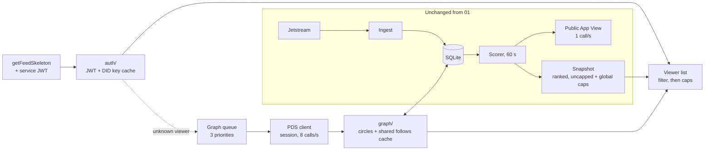

# Upstaged — Network feed tech design

2026-09-24 · @Nico Santini · Status: Final

Companion to [02-PRD-network-feed.md](02-PRD-network-feed.md) and
[02-BRIEF-network-feed.md](02-BRIEF-network-feed.md). The PRD owns the
product rules. This document owns how the code changes. It is a delta on
[01-TECH-DESIGN.md](01-TECH-DESIGN.md). A section of `01` that this
document does not name stays as it is.

Numbers tagged [Likely] or [Guessing] are estimates. The probe command
(section 12) measures them before the graph work starts. Section 17 puts
the probe first for this reason.

## 1. Decision summary

| Decision | Choice | Why |
|---|---|---|
| Viewer identity | Check the service JWT on each `getFeedSkeleton` request | The feed is different for each viewer, so the viewer DID must be proven |
| JWT crypto | `k256` and `p256` (RustCrypto) plus `bs58`, and a JWT parser written by hand | `01` rules out `atrium`. General JWT crates do not support ES256K |
| Graph calls | A second client to the PDS, authenticated with the `BSKY_HANDLE` session | The public App View allows 1 call each second. The PDS allows 3,000 each 5 minutes for each IP |
| Rate limits | Separate limiters: public client for the scorer, PDS client for the graph | A graph backlog can never slow down promotion |
| Graph priority | Three levels: first build, degree-1 refresh, degree-2 cache fill | A new viewer gets pairs within seconds |
| Graph storage | SQLite through `src/store/`, loaded into memory when needed | A restart does not turn every viewer into a first open |
| DIDs in memory | `xxh3_64` values | 8 bytes for each DID, and `xxhash-rust` is already a dependency |
| Degree-2 memory | Keep the sampled follows for each viewer. Build the degree-2 set only while a viewer list is built | Memory grows with distinct accounts, not with viewers × 10,000 |
| Viewer list | Built on request, one list for each (viewer, generation), as `u32` indices into the snapshot | The list is cheap, and it is removed with the viewer |
| Cursor | Pin the snapshot generation and the circle version. Resume at the exact index in that list | A circle refresh during a scroll cannot repeat items or end the feed early |
| Rollback | `UPSTAGE_PERSONALISE=false` brings back the global feed after a restart | This is the cheapest rollback if JWT checks or the crawler fail |
| Measure first | `upstage graph-probe` CLI before the graph and serving work | The cost numbers in this document are estimates |

## 2. System overview



The request path never calls the network. It reads the DID key cache,
the viewer's circle and the snapshot. When data is missing, it returns an
empty page and puts the work in a queue.

## 3. Crate layout changes

```
src/
  auth/
    mod.rs          verify(token) -> Result<ViewerDid, AuthError>
    jwt.rs          split, base64url decode, claims, low-S check
    keys.rs         multibase decode, k256 / p256 verify
    did.rs          DID doc resolver (plc.directory, did:web) and key cache
  graph/
    mod.rs          GraphHandle: read side for the HTTP handler
    circle.rs       Circle: follows, follows-me, sampled follows
    build.rs        first build and refresh steps
    queue.rs        three-priority work queue and the worker task
    cache.rs        shared follows cache (account -> sorted Vec<u64>)
    schedule.rs     refresh scheduler, LRU and idle eviction
    metrics.rs      hourly health log line
  appview/
    pds.rs          PdsClient: session, refresh, limiter, getFollows, getRelationships
  http/
    viewer.rs       per-viewer list build and cache
  store/
    viewers.rs      viewers, viewer_follows, viewer_checks tables
    follows_cache.rs  follows_cache table
  graph_probe.rs    the probe CLI (section 12)
```

The session code moves from `publish.rs` into `appview/pds.rs`, so that
`publish` and the graph share one login and refresh path.

New dependencies: `k256` (features `ecdsa`, `sha256`), `p256` (features
`ecdsa`, `sha256`), `bs58`.

## 4. Configuration

All new variables follow the `01` convention: an integer with the unit in
the name.

| Variable | Default | Meaning |
|---|---|---|
| `UPSTAGE_PERSONALISE` | `true` | `false` serves the global feed as in `01` and skips JWT checks |
| `UPSTAGE_SERVICE_DID` | `did:web:<UPSTAGE_HOSTNAME>` | The expected JWT `aud` |
| `UPSTAGE_PLC_URL` | `https://plc.directory` | DID resolver for `did:plc` |
| `UPSTAGE_MAX_VIEWERS` | `1000` | Maximum number of stored circles |
| `UPSTAGE_GRAPH_REFRESH_AGE_H` | `6` | Degree-1 refresh age |
| `UPSTAGE_GRAPH_IDLE_EVICT_D` | `7` | Remove a circle after this many days with no requests |
| `UPSTAGE_FOLLOWS_ME_DEPTH` | `1000` | How many of the highest-ranked pairs get the "follows me" check |
| `UPSTAGE_D2_FOLLOWS_SAMPLE` | `100` | How many of the viewer's most recent follows degree 2 uses |
| `UPSTAGE_D2_FOLLOWS_DEPTH` | `100` | How many of each sampled account's most recent follows degree 2 uses |
| `UPSTAGE_D2_REFRESH_AGE_H` | `24` | How long a shared follows list is kept |
| `UPSTAGE_GRAPH_RPS` | `8` | PDS client rate. The PDS limit is 10 each second for each IP |
| `UPSTAGE_PDS_URL` | `https://bsky.social` | PDS for the session and the graph calls |

`BSKY_HANDLE` and `BSKY_APP_PASSWORD` become required for `upstage run`
when `UPSTAGE_PERSONALISE` is `true`.

## 5. Viewer authentication

`auth::verify` runs on each request when `UPSTAGE_PERSONALISE` is `true`.
It reads `Authorization: Bearer <jwt>`.

Checks, in this order. The first failure returns `AuthError`, and the
handler returns an empty page with status 200.

1. The token has three base64url parts. The header `alg` is `ES256K` or
   `ES256`. `typ` is `JWT` when it is present.
2. `exp` is in the future, with 30 seconds of clock skew.
3. `aud` equals `UPSTAGE_SERVICE_DID`. A `#` fragment on `aud` is
   removed before the check.
4. If `lxm` is present, it equals `app.bsky.feed.getFeedSkeleton`.
5. `iss` is a `did:plc` or `did:web`. A `#` fragment is removed. The
   viewer DID is the part before the fragment.
6. The key for `iss` is in the DID key cache. If it is not, the handler
   returns an empty page and sends the token to the resolver task. The
   request does not wait for the network.
7. The signature verifies with the `#atproto` key. The signature must be
   low-S. If it fails, the resolver fetches the DID document again, one
   time, because the key can rotate.

The resolver task:

- `did:plc` is resolved at `UPSTAGE_PLC_URL/<did>`. `did:web` is
  resolved at `https://<host>/.well-known/did.json`.
- The key is the `publicKeyMultibase` of the `#atproto` verification
  method: base58btc with a `z` prefix, a multicodec prefix (`0xE7 0x01`
  for k256, `0x80 0x24` for p256), then a compressed point.
- Cache: an entry is stale after 1 hour and removed after 24 hours. A
  stale entry is used and refreshed in the background. The cache holds at
  most `2 × UPSTAGE_MAX_VIEWERS` entries.
- After a token that was put in the queue verifies, the resolver adds a
  first build for that viewer to the graph queue.

`jti` is not tracked. A token used again only gets the same viewer's
feed.

## 6. Viewer graph

### 6.1 Circle

A `Circle` is the data for one viewer:

| Field | Source | In memory |
|---|---|---|
| `follows` | `getFollows`, all pages | `HashSet<u64>` |
| `follows_me` | `getRelationships` on the authors of the top `UPSTAGE_FOLLOWS_ME_DEPTH` pairs | `HashSet<u64>` of the authors that follow the viewer |
| `checked` | The authors already sent to `getRelationships` | `HashSet<u64>` |
| `d2_sample` | The first `UPSTAGE_D2_FOLLOWS_SAMPLE` entries of `getFollows` with `sort=latest` | `Vec<Did>` |
| `state` | `building_d1`, `building_fm`, `building_d2`, `ready` | enum |
| `last_request_at`, `d1_refreshed_at` | request path, builder | `i64` |

An author is connected when its hash is in `follows` or `follows_me`, or
when it is in the shared follows list of an account in `d2_sample`.

### 6.2 First build

The resolver adds one `FirstBuild(viewer)` job at priority 0. The job
runs three steps. After each step, the circle is saved and the viewer's
cached lists are dropped, so that the next request shows the new pairs.

1. **Follows.** Page `getFollows?actor=<viewer>&sort=latest&limit=100`
   to the end. Keep the first `UPSTAGE_D2_FOLLOWS_SAMPLE` DIDs as
   `d2_sample`.
2. **Follows me.** Take the original and quoter DIDs of the top
   `UPSTAGE_FOLLOWS_ME_DEPTH` pairs in the current snapshot. Remove the
   DIDs that are in `follows` or `checked`. Send the rest to
   `getRelationships?actor=<viewer>&others=...`, 30 each call. Keep each
   author that has `followedBy`.
3. **Degree 2.** For each account in `d2_sample` that has no fresh entry
   in the shared cache, get
   `getFollows?actor=<account>&sort=latest&limit=<UPSTAGE_D2_FOLLOWS_DEPTH>`
   (one page when the depth is 100 or less). Put the result in the shared
   cache.

Estimated first-build time at 8 calls each second, for a viewer who
follows 500 accounts: step 1 is 5 calls (under 1 second), step 2 is at
most 67 calls (about 8 seconds), step 3 is at most 100 calls (about 13
seconds, less with shared entries). [Likely] The PRD target of 15 seconds
for "I follow" pairs is met with a large margin.

### 6.3 Refresh

The scheduler runs each minute:

- **Degree-1 refresh.** A viewer gets a `Refresh(viewer)` job at
  priority 1 when `d1_refreshed_at` is older than
  `UPSTAGE_GRAPH_REFRESH_AGE_H` and the viewer sent a request after that
  refresh. The job runs steps 1 and 2 again. It resets `checked`, so
  authors that entered the ranked list since the last refresh get
  checked (PRD: within 6 hours).
- **Degree-2 refill.** A shared cache entry older than
  `UPSTAGE_D2_REFRESH_AGE_H` gets a `Refill(account)` job at priority 2,
  only when an active viewer's `d2_sample` names it.
- **Idle eviction.** A viewer with no request for
  `UPSTAGE_GRAPH_IDLE_EVICT_D` is removed from memory and SQLite.
- **LRU eviction.** When a first build would take the count above
  `UPSTAGE_MAX_VIEWERS`, the viewer with the oldest `last_request_at` is
  removed first. Each removal writes one `graph.evicted` log line with
  the reason and no DID.

A refresh builds a new circle and replaces the old one in one step. If a
refresh fails part of the way, the old circle stays (PRD edge case).

### 6.4 Shared follows cache

`account DID -> (fetched_at, sorted Vec<u64>)`. Entries are loaded from
SQLite when needed and kept in memory while an active viewer names them.
Memory for each entry is 8 bytes for each follow. [Likely] The worst case
is 100,000 distinct accounts × 100 follows, or 80 MB, if no two viewers
share a sampled account. [Guessing] The real overlap is large, because
many viewers follow the same popular accounts. The probe measures the
overlap.

## 7. PDS client and session

`appview::pds::PdsClient`:

- **Login.** `com.atproto.server.createSession` at startup. It keeps
  `accessJwt` and `refreshJwt` in memory only. The limit is 300 logins
  each day, and restarts need far fewer.
- **Refresh.** On a response with `ExpiredToken`, or 5 minutes before
  the `exp` of the access token, it calls
  `com.atproto.server.refreshSession`. If the refresh fails, it logs in
  again, one time. Then it fails the job, and the job goes back in the
  queue.
- **Calls.** App View methods go to `UPSTAGE_PDS_URL/xrpc/<nsid>` with
  the access token and the header
  `atproto-proxy: did:web:api.bsky.app#bsky_appview`.
- **Limiter.** One interval at `UPSTAGE_GRAPH_RPS`. The queue worker
  takes the next job from the highest priority that is not empty, and
  runs one call at a time through the limiter.
- **Retries.** The same rules as `01` §8 (429, 5xx and transport
  errors, 1 s, 2 s and 4 s).

`publish` uses the same client. The scorer keeps its public client at
`UPSTAGE_APPVIEW_RPS`, unchanged.

Call budget. [Likely] For each viewer, a degree-1 refresh costs at most
77 calls (10 follows pages and 67 `getRelationships`). A degree-2 refill
costs at most 100 calls each day before sharing. In the worst case, each
viewer costs 4 × 77 + 100 = 408 calls each day. At 1000 viewers that is
about 4.7 calls each second, inside the 8 each second budget. The budget
covers about 1,700 viewers in the worst case. The probe replaces these
numbers with measured ones before the default of `UPSTAGE_MAX_VIEWERS`
is final.

**Risk from R3.** The graph uses the feed owner's account. If Bluesky
limits that account, `publish` is also limited until the limit ends.

## 8. Data model

Schema version 2. The migration from version 1 only adds tables. It runs
in one transaction, and `meta` records the new version. `01` §6 does not
change.

| Table | Key | Columns | Retention |
|---|---|---|---|
| `viewers` | `viewer_did` | `first_seen_at`, `last_request_at`, `d1_refreshed_at`, `state`, `d2_sample` (JSON list of DIDs) | Removed at idle or LRU eviction |
| `viewer_follows` | `(viewer_did, subject_hash)` | none | Replaced at each refresh |
| `viewer_checks` | `(viewer_did, author_hash)` | `follows_me` (bool), `checked_at` | Replaced at each refresh |
| `follows_cache` | `account_did` | `fetched_at`, `follows` (BLOB of sorted little-endian `u64`) | Removed 2 × `UPSTAGE_D2_REFRESH_AGE_H` after the last use |

Hashes are stored, not DIDs, except for the viewer DID and the sampled
accounts, because those are needed for API calls. Viewer DIDs are in
SQLite only. They are never in a log line.

## 9. Serving

### 9.1 Snapshot changes

- `FeedItem` gets `quote_did`, `original_did` (as `u64` hashes) and the
  time field that the per-day cap reads.
- `snapshot::build` returns the ranked list with no caps, plus a
  `global: Vec<u32>` index list with the `01` caps applied. The
  kill switch and the global mode serve `global`.
- The two caps move into `snapshot::caps::apply(items, indices) ->
  Vec<u32>`. The scorer uses it for `global`. The viewer list uses it
  for each viewer.

### 9.2 Viewer list

For a verified viewer with a circle in any state after `building_d1`:

1. Look up the cache entry `(viewer, generation)`. On a hit, go to
   step 5.
2. Build the degree-2 set: the union of the shared follows lists of the
   accounts in `d2_sample`, as a temporary `HashSet<u64>`. [Likely] At
   most 10,000 entries, and about 1 ms.
3. Walk the ranked list. Keep an item when `quote_did` or
   `original_did` is in `follows`, in `follows_me` (only for the top
   `UPSTAGE_FOLLOWS_ME_DEPTH` items), or in the degree-2 set. Then drop
   the temporary set.
4. Apply `caps::apply` to the kept indices. Store the result as the
   cache entry. The cache keeps the current and previous generation for
   each viewer.
5. Serve the page from the cache entry.

[Guessing] Steps 2 to 4 take less than 10 ms for 100,000 items. The probe
measures it. Requests for viewers in `building_d1` get an empty page.

### 9.3 Cursor

Personalised cursors add the circle version to the `01` §11.1 format:
`base64url("{generation}:{circle_version}:{index}:{rank_bits}:{cid}")`.
The global mode keeps the `01` format.

- Each circle has a `circle_version`. It goes up by one each time a build
  step or a refresh replaces the circle.
- The viewer list cache is keyed by `(viewer, generation,
  circle_version)`. It keeps the current and the previous entry for each
  viewer.
- To resume, the handler takes the cached list for the cursor's
  generation and circle version. When `items[index].cid` matches, the
  page starts at `index + 1`. The list does not change while it is held,
  so a circle refresh during a scroll cannot repeat an item or end the
  feed early.
- A pure `(rank, cid)` search is not safe. The quoter cap defers items,
  so a capped list is not in strict rank order.
- When that list is no longer held, the handler uses the `01` resume
  paths on the viewer's current list. See D1.
- A cursor holds no viewer data. A cursor from another viewer resumes in
  the requester's own list, so it shows nothing of the other viewer.
- When the cursor's generation is no longer held (a scroll of more than
  about 2 minutes), the `01` fallback applies. See D1.

### 9.4 Responses

- Personalised responses send `Cache-Control: private, no-store`.
- The global mode (`UPSTAGE_PERSONALISE=false`) keeps
  `Cache-Control: public, max-age=30`.
- Each empty page (no token, a token that is not valid, a key that is
  not cached, no circle, an empty circle) is a normal 200 response with
  an empty `feed` and no `cursor`.

## 10. Kill switch

`UPSTAGE_PERSONALISE=false`, then a restart:

- The handler does not read the JWT and serves `global`.
- The graph worker, the scheduler and the resolver do not start. The
  graph tables stay in SQLite.
- A later restart with `true` loads the circles again. Circles older
  than the idle limit are removed at the first scheduler pass.

## 11. Metrics

`graph::metrics` writes one `graph.health` JSON log line each hour:

| Field | Meaning |
|---|---|
| `active_viewers` | Viewers with a request in the last `UPSTAGE_GRAPH_IDLE_EVICT_D` |
| `median_new_pairs_24h` | Median, over active viewers, of circle pairs promoted in the last 24 hours |
| `zero_share` | Share of active viewers with 0 such pairs |
| `median_discovery_share` | Median share of a viewer's circle pairs that pass only through degree 2 |
| `evicted_1h` | Circles removed in the last hour, by reason |
| `graph_calls_1h` | PDS calls in the last hour, by method |
| `queue_depth` | Jobs waiting, by priority |

The line is computed from each active viewer's current list. [Likely] At
1000 viewers, this takes a few seconds, once each hour. No field names a
viewer.

## 12. Probe command

`upstage graph-probe --handle <h> [--handle <h> ...]` is a CLI command,
like `validate` and `dump`. It logs in with `BSKY_HANDLE`, reads the
current feed rows from SQLite, and runs a first build for each handle
with no writes. It prints:

- The calls, time and pages for each build step.
- The sizes of `follows`, `follows_me` and the degree-2 set.
- The bytes of memory for each circle and for the shared cache entries.
- The overlap of shared cache entries across the handles.
- The time to build the viewer list for 100,000 items.
- The circle pairs in the last 24 hours, and the discovery share.
- A check of `sort=latest` order: the first `getFollows` page compared
  with the account's newest `app.bsky.graph.follow` records from
  `com.atproto.repo.listRecords`.

Run it for about 10 handles with small, medium and large follow counts.
Then set the defaults of `UPSTAGE_MAX_VIEWERS` and `UPSTAGE_GRAPH_RPS`
from the measured cost for each viewer.

## 13. Memory

Estimates for 1000 active viewers. The limit stays at `mem_limit: 512m`.

| Part | Estimate |
|---|---|
| Base process (from `traffic-analysis.md`) | 150–250 MB |
| Circles: `follows`, `follows_me`, `checked` | [Likely] 20–60 MB |
| Shared follows cache | [Guessing] 10–80 MB, depending on overlap |
| Viewer lists, 2 generations | [Likely] under 10 MB |
| DID key cache | under 1 MB |
| **Total** | [Guessing] 190–400 MB |

If the probe shows more than 450 MB, reduce `UPSTAGE_MAX_VIEWERS` or
`UPSTAGE_D2_FOLLOWS_SAMPLE` before launch.

## 14. Deviations

| Id | Source says | This design does | Why |
|---|---|---|---|
| D1 | PRD: "never sees the same item twice" during a scroll | A scroll longer than about 2 minutes uses the `01` fallback, which can repeat items | This behaviour exists in `01` and is not caused by circles. Keeping more generations costs about 20 MB each |
| D2 | PRD: `UPSTAGE_GRAPH_REFRESH_AGE`, `UPSTAGE_GRAPH_IDLE_EVICT`, `UPSTAGE_D2_REFRESH_AGE` | `_H`, `_D` and `_H` suffixes | The `01` config puts the unit in the name |
| D3 | `01` §8: App View calls are not authenticated | Graph calls use the PDS session | The public limit is too low for the graph |
| D4 | `01` §11.1: the JWT is ignored, and `Cache-Control` is `public` | The JWT is checked, and personalised responses are `private, no-store` | The feed is different for each viewer |

## 15. Changes to other documents

- `AGENTS.md`: story 03 adds `graph/` and `graph_probe` as `appview/`
  callers. Story 05 adds `auth/` as the only module that calls the DID
  resolvers.
- `01-TECH-DESIGN.md` §11.1 and §8: add a line that points to this
  document.
- `.env.example` and `RUNBOOK.md`: the new variables, the kill switch,
  and the `graph-probe` command.

## 16. Testing

| Layer | What |
|---|---|
| Unit, `auth/` | Tokens signed in the test with k256 and p256 keys: valid, expired, wrong `aud`, wrong `lxm`, high-S, unknown `alg`, key rotation |
| Unit, `auth/did.rs` | Real DID document fixtures for `did:plc` and `did:web`, multibase decode |
| Unit, `graph/` | A fake `PdsClient`: build steps, the order of priorities, failure during a refresh keeps the old circle, LRU and idle eviction |
| Unit, `http/viewer.rs` | The filter for each connection type, the caps after the filter, followers of followers are not included, the cursor across a circle refresh |
| Regression | With `UPSTAGE_PERSONALISE=false`, the output equals the `01` global feed for the same rows |
| Network, `#[ignore]` | The probe against real handles. `refreshSession` against the real PDS |

## 17. Build order

The stories are in [02-stories/](02-stories/). Each story is a vertical
slice that can be shown working on its own.

**Rollout rule.** `UPSTAGE_PERSONALISE` defaults to `false` until story
11. Each story merges with the global feed unchanged. Story 11 changes
the default to `true` (the value in section 4).

| # | Story | Follows |
|---|---|---|
| 01 | Snapshot carries authors, and the caps become reusable (prefactor) | none |
| 02 | Shared PDS session with refresh (prefactor) | none |
| 03 | Graph probe | 02 |
| 04 | Probe gate (operator) | 03 |
| 05 | Viewer identity behind the switch | none |
| 06 | "I follow" circle, end to end | 01, 04, 05 |
| 07 | "Follows me" connections | 06 |
| 08 | Degree 2 with the shared follows cache | 06 |
| 09 | Circles stay current and bounded | 07, 08 |
| 10 | Feed health metrics | 09 |
| 11 | Launch | 04, 10 |

Story 04 is a gate. If the measured cost for each viewer does not fit
the budget in section 7 or the memory in section 13, stop and revise
this document before story 06.
