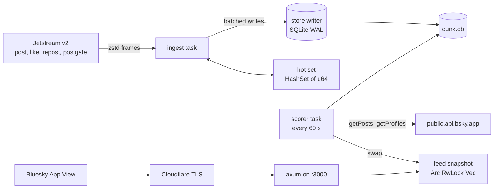

# Dunk Feed — Tech Design

2026-09-18 · Nico Santini. Status: draft for implementation.

Companion to [PRD.md](../PRD.md). The PRD owns the product rules and the score.
This document owns how the code is shaped. Where the two disagree, section 12
lists the deviation and the reason. Numbers come from
[traffic-analysis.md](traffic-analysis.md).

## 1. Decision summary

| Decision | Choice | Why |
|---|---|---|
| Language | **Rust**, stable toolchain | Lowest and flattest memory on a 1 to 2 GB VM, no GC pauses, one static binary. Go's only edge is a first-party Jetstream client. That edge is about 200 lines we write once (section 5) |
| Shape | **One crate, one binary `dunk`**, tokio tasks for ingest, scorer and HTTP | One deploy unit, one toolchain. Agreed 2026-09-18 |
| Store | **SQLite** through `rusqlite` (bundled), WAL mode, one writer thread | Working set is under 500 MB on disk and under 250 MB in RAM. No second service to run or back up. Agreed 2026-09-18 |
| Retention | **Candidates 48 h, feed items 30 d** | Agreed 2026-09-18. Section 7 |
| Deploy | **Docker Compose** on the VM, plain HTTP on port 3000, **Cloudflare** terminates TLS | Agreed 2026-09-18. Section 11 |
| Jetstream | **v2** protocol with dict-zstd | v1 is legacy. Verified live 2026-09-18 |
| Serving path | Reads an in-memory snapshot, never SQLite | p99 under 300 ms is a product constraint |
| Truth | App View counts promote a pair. Local counts only pick candidates | PRD rule, kept |

**What the feed is, in one line (Nico, 2026-09-21).** Quote posts that got more
engagement than the post they quoted. Tone is not a criterion. A quote that
agrees, extends or reframes the original counts exactly as much as one that
mocks it. The PRD's words "dunk", "victim" and "funny" are shorthand for the
engagement rule, not extra filters, and no story adds a tone or sentiment
check. Reference pair, counts read from the App View on 2026-09-21:

| Side | Post | likes | reposts | replies | `E` |
|---|---|---|---|---|---|
| `Q` | `at://did:plc:o7xt7svg2xtjbb4e2xqahqqc/app.bsky.feed.post/3mvxhe7uuck2n` ([bsky.app](https://bsky.app/profile/spavel.bsky.social/post/3mvxhe7uuck2n)) | 513 | 99 | 6 | 714 |
| `O` | `at://did:plc:ofzkhjyyh4kl4a35wxgmobmm/app.bsky.feed.post/3mvxb5n76u22b` | 125 | 17 | 2 | 160 |

`D = 714 / (160 + 5) = 4.33`, both sides clear `P = 50`, so the pair
qualifies under the defaults. Story 07's live test and its recorded
`getposts_normal_quote.json` fixture use this pair.

**Rust versus Go, in full.** Both languages handle 400 events per second at under
10% of one core. Go has `bluesky-social/jetstream` Go packages and `indigo`,
which are first-party and current. The Rust Jetstream crates are thin:
`jetstream-oxide` last changed in April 2025, before v2 shipped;
`atproto-jetstream` is small and single-maintainer. So in Rust we own the
Jetstream client. It is a dictionary fetch, a websocket, a zstd decoder and a
`serde` type, about 200 lines with tests. For the App View we call five XRPC
methods with `reqwest` and typed structs, so we do not need `atrium-api` either.
Rust wins on the constraint that matters here, memory on a small VM, and on
your stated preference. [Likely]

## 2. System overview



Three long-lived tasks share one process:

| Task | Reads | Writes | Touches network |
|---|---|---|---|
| `ingest` | Jetstream, hot set | store writer channel, hot set | Jetstream only |
| `scorer` | SQLite, App View | SQLite, feed snapshot | App View only |
| `http` | feed snapshot, config | `interactions` table through the writer | Serves only |

The ingest task never waits on SQLite. It sends batches over a bounded channel to
one writer thread. The writer commits each batch and the Jetstream `seq` in the
same transaction, so a crash never double counts (section 5.4).

## 3. Crate layout

```
Cargo.toml
rust-toolchain.toml          stable, pinned minor
src/
  main.rs                    clap dispatch, tracing init, anyhow at the edge
  cli.rs                     `run`, `validate`, `publish`, `dump`
  config.rs                  every tunable, env var + PRD default
  jetstream/
    mod.rs
    client.rs                dictionary fetch, connect, decode, reconnect, resume
    event.rs                 serde types for the v2 envelope and payloads
  ingest/
    mod.rs                   the task: event -> Op, batching, stats
    embed.rs                 quote detection, pure. Built in story 02, used by validate and ingest
    hotset.rs                HashSet<u64> of URI hashes, pure
  store/
    mod.rs                   Store handle, open, migrate
    schema.rs                CREATE TABLE statements, versioned
    writer.rs                single writer thread, Op enum, batch commit
    pairs.rs  counts.rs  feed.rs  authors.rs  meta.rs  interactions.rs
  score.rs                   E, D, rank, qualifies. Pure, no I/O
  appview/
    mod.rs                   client: getPosts, getProfiles, getQuotes, getFeed
    types.rs                 serde types, only the fields we read
  scorer/
    mod.rs                   the task: select, verify, guard, promote, expire, snapshot
    verify.rs                turns App View views into VerifiedPair or a Drop reason
    guards.rs                follower floor, author state, labels, caps
    snapshot.rs              ranked Vec<FeedItem>, page cap ordering
  http/
    mod.rs                   axum router, state
    did.rs                   /.well-known/did.json
    describe.rs              describeFeedGenerator
    skeleton.rs              getFeedSkeleton
    cursor.rs                feed cursor encode/decode, pure
    interactions.rs          sendInteractions
    health.rs                /healthz
  publish.rs                 writes the app.bsky.feed.generator record
  validate.rs                phase 0 probe (section 10)
tests/
  fixtures/                  real Jetstream frames, real getPosts bodies
Dockerfile  compose.yaml  .env.example
docs/  stories/  AGENTS.md
```

Dependencies, all common and maintained: `tokio`, `tokio-tungstenite` (rustls),
`futures-util`, `zstd`, `serde`, `serde_json`, `rusqlite` (`bundled`), `reqwest` (rustls, json),
`axum`, `tower-http` (trace, timeout), `clap`, `tracing`, `tracing-subscriber`,
`thiserror`, `anyhow`, `base64`, `ahash` or `xxhash-rust`, `time` or `chrono`.
No `atrium`, no ORM, no async SQLite.

## 4. Configuration

Every value is an environment variable with the PRD default. `config.rs` parses
once at start and fails fast on a bad value.

| Variable | Default | Meaning |
|---|---|---|
| `DUNK_DB_PATH` | `/data/dunk.db` | SQLite file |
| `DUNK_HTTP_ADDR` | `0.0.0.0:3000` | Listen address |
| `DUNK_HOSTNAME` | required | Public hostname, forms `did:web:<hostname>` |
| `DUNK_PUBLISHER_DID` | required | Your account DID. Forms the feed at-URI |
| `DUNK_FEED_RKEY` | `dunks` | Record key of the generator record |
| `DUNK_JETSTREAM_URL` | `wss://jetstream.us-east.bsky.network,wss://jetstream.us-west.bsky.network` | Comma-separated host list, no path. The client rotates to the next host on every failed connect. On 2026-09-18 us-east returned 503 for over 40 minutes while us-west served |
| `DUNK_APPVIEW_URL` | `https://public.api.bsky.app` | |
| `DUNK_W_REPOST` `DUNK_W_REPLY` | `2.0` `0.5` | `Wr`, `Wc` |
| `DUNK_K` | `5` | Smoothing |
| `DUNK_P` | `50` | Popularity floor |
| `DUNK_M` | `1.25` | Dunk margin |
| `DUNK_CANDIDATE_TTL_H` | `48` | Unpromoted pair lifetime and re-verify horizon |
| `DUNK_FEED_TTL_D` | `30` | Promoted item lifetime |
| `DUNK_SCORER_INTERVAL_S` | `60` | |
| `DUNK_REVERIFY_INTERVAL_S` | `600` | Promoted pairs under 48 h old |
| `DUNK_FOLLOWER_FLOOR` | `2000` | Guard, section 9. `0` disables |
| `DUNK_DROP_LABELS` | `porn,sexual,graphic-media,nudity,!hide,!warn,spam` | Comma-separated label values that drop a pair. Section 9 |
| `DUNK_PREFILTER_FRACTION` | `0.5` | Local `E` must reach `P * fraction` before an App View call |
| `DUNK_APPVIEW_RPS` | `1.0` | Verifier rate limit |
| `DUNK_LOG` | `info` | `tracing` filter |
| `BSKY_HANDLE` `BSKY_APP_PASSWORD` | publish only | Never read by `run` |

## 5. Ingest

### 5.1 Jetstream v2 client

1. `GET {host}/xrpc/network.bsky.jetstream.getZstdDictionary`. Keep the body and
   the `x-zstd-dictionary-id` header. Cache both on disk next to the DB.
2. Connect to
   `{host}/xrpc/network.bsky.jetstream.subscribeEvents?collections=app.bsky.feed.post&collections=app.bsky.feed.like&collections=app.bsky.feed.repost&collections=app.bsky.feed.postgate&kinds=commit&zstdDictionary=<id>&cursor=<seq>`.
3. Each binary frame is one zstd frame. Decode with the dictionary into the JSON
   text. Parse the envelope `{"$type":"message","payload":{...}}`.
4. Dispatch on `payload.$type`. Handle `#commit`. Log `#info` and act on
   `OutdatedCursor` (section 5.4). Ignore `#identity`, `#account`, `#sync`.
5. On close or error: back off 1 s, 2 s, 4 s up to 60 s, rotate to the next host
   in the list, and reconnect with `last_seq + 1`. The first connect follows the
   same rule; only a configuration error is fatal. If the server rejects the
   cursor with HTTP 400, retry once from the head. The backoff counter resets on
   the first event of a connection, not on the handshake.
6. If the dictionary cannot be fetched from any host, connect uncompressed, log
   at `warn`, expose `is_compressed() == false` for `/healthz`, and retry the
   fetch on every reconnect and every 10 minutes. The dictionary is cached as
   one file per id, written atomically. Three consecutive decompression
   failures discard it and force a refetch.

The client exposes an `async fn next(&mut self) -> Result<Event>` and hides
reconnects. Tests feed it recorded frames from `tests/fixtures/`.

### 5.2 Event to operation

`ingest/mod.rs` turns each commit into zero or one `Op` for the writer. It never
touches the network and never reads SQLite.

| Collection, operation | Rule | `Op` |
|---|---|---|
| `post` create, embed is a post quote (5.3), `did != original_did` | Insert pair. Add both URIs to the hot set | `InsertPair` |
| `post` create, has `reply.parent.uri`, parent in hot set | | `Incr{replies}` |
| `post` create, neither | Drop | none |
| `post` delete | URI is `at://{did}/app.bsky.feed.post/{rkey}`. If in hot set | `DeletePost` (removes the pair on either side, evicts feed rows) |
| `like` create, `record.subject.uri` in hot set | | `Incr{likes}` |
| `repost` create, `record.subject.uri` in hot set | | `Incr{reposts}` |
| `like` or `repost` delete | **Dropped.** The event carries only an rkey, not the subject. Section 12, D3 | none |
| `postgate` create or update | For each `detachedEmbeddingUris` entry in the hot set | `Detach{quote_uri}` |
| `post` update | Treat as create for the embed check. Rare (11 in 20k) | as create |

Rules for the hot set: a URI enters when a pair is inserted and leaves when the
pair expires or is deleted. The set holds `u64` hashes, not strings. At 1.1M
entries that is 13 to 20 MB. A hash collision at 64 bits is a counter that
drifts by one event, which the verifier corrects.

On start, the hot set is rebuilt from `pairs` in one scan.

### 5.3 Quote detection, pure

```rust
pub enum Embed { Quote { original_uri: AtUri }, NotAQuote }
pub fn detect(record: &serde_json::Value) -> Embed
```

- `embed.$type == "app.bsky.embed.record"` → `embed.record.uri`
- `embed.$type == "app.bsky.embed.recordWithMedia"` → `embed.record.record.uri`
- Anything else, including `gallery`, `images`, `video`, `external`, unknown or
  missing → `NotAQuote`. Unknown is not an error.
- The URI must parse as `at://<did>/app.bsky.feed.post/<rkey>` or it is
  `NotAQuote`.

### 5.4 Batching, checkpoints and exactly-once

The writer thread drains the channel every 500 ms or 1,000 ops, whichever comes
first, and runs one transaction:

```
BEGIN
  apply each op
  UPDATE meta SET value = <last seq in batch> WHERE key = 'jetstream_seq'
COMMIT
```

The cursor and the counters move together. After a crash the client resumes at
the committed `seq`, inclusive, so at most one event is replayed, and that one is
the batch boundary. Resume with `seq + 1` to avoid even that.

If the stored `seq` is older than the 36-hour lookback, Jetstream clamps it and
sends `#info OutdatedCursor`. On that frame, log at `warn`, drop the local
counters' claim to accuracy by setting `counts.dirty = 1` for every row, and
continue from the head. The verifier repairs promoted pairs on its next pass.
Do not try to catch up event by event.

### 5.5 Ingest stats

Every 60 s, log one line: events/s by collection, hot set size, ops/s by type,
**gate hit rate** (share of like and repost events whose subject was in the hot
set), channel depth, and lag in seconds between `payload.time` and now. The gate
hit rate is the one number the traffic analysis could not measure.

## 6. Data model

SQLite, WAL, `synchronous=NORMAL`, `cache_size` 64 MB, one writer. Versioned
schema in `store/schema.rs` with a `schema_version` row in `meta`.

```sql
CREATE TABLE pairs (
  quote_uri     TEXT PRIMARY KEY,
  quote_did     TEXT NOT NULL,
  quote_cid     TEXT NOT NULL,
  original_uri  TEXT NOT NULL,
  original_did  TEXT NOT NULL,
  quoted_at     INTEGER NOT NULL,   -- unix seconds, from record.createdAt
  first_seen_at INTEGER NOT NULL,
  state         TEXT NOT NULL DEFAULT 'candidate',  -- candidate | promoted | dropped
  drop_reason   TEXT                -- see section 8.3
);
CREATE INDEX pairs_original ON pairs(original_uri);
CREATE INDEX pairs_state_seen ON pairs(state, first_seen_at);

CREATE TABLE counts (
  post_uri      TEXT PRIMARY KEY,
  likes INTEGER NOT NULL DEFAULT 0,
  reposts INTEGER NOT NULL DEFAULT 0,
  replies INTEGER NOT NULL DEFAULT 0,
  last_event_at INTEGER NOT NULL,
  dirty         INTEGER NOT NULL DEFAULT 1   -- moved since last scorer pass
);
CREATE INDEX counts_dirty ON counts(dirty) WHERE dirty = 1;

CREATE TABLE feed (
  quote_uri     TEXT PRIMARY KEY REFERENCES pairs(quote_uri),
  quote_cid     TEXT NOT NULL,
  quote_did     TEXT NOT NULL,
  original_did  TEXT NOT NULL,
  quoted_at     INTEGER NOT NULL,
  v_likes_q INTEGER, v_reposts_q INTEGER, v_replies_q INTEGER,
  v_likes_o INTEGER, v_reposts_o INTEGER, v_replies_o INTEGER,
  ratio         REAL NOT NULL,
  rank          REAL NOT NULL,
  promoted_at   INTEGER NOT NULL,
  verified_at   INTEGER NOT NULL
);
CREATE INDEX feed_rank ON feed(rank DESC);

CREATE TABLE authors (
  did           TEXT PRIMARY KEY,
  followers     INTEGER,
  active        INTEGER NOT NULL,     -- 0 deactivated/deleted/takendown
  labels        TEXT,                 -- JSON array of label values
  checked_at    INTEGER NOT NULL
);

CREATE TABLE interactions (          -- from sendInteractions
  received_at INTEGER NOT NULL, item TEXT, event TEXT, feed_context TEXT, req_id TEXT
);

CREATE TABLE meta (key TEXT PRIMARY KEY, value TEXT NOT NULL);
-- keys: schema_version, jetstream_seq, zstd_dict_id, last_scorer_pass
```

Sizes at the measured rates: `pairs` about 550k rows, `counts` at most 1.1M,
`feed` under 100k, whole file under 500 MB. A `counts` row is created on the
first event for a hot-set URI, not on pair insert, so most `O` rows never exist.

## 7. Scoring and promotion

### 7.1 Pure functions, `score.rs`

```rust
pub struct Counts { likes: u32, reposts: u32, replies: u32 }
pub fn engagement(c: &Counts, w: &Weights) -> f64          // E(p)
pub fn ratio(eq: f64, eo: f64, k: f64) -> f64              // D
pub fn qualifies(eq: f64, eo: f64, cfg) -> bool            // max(eo,eq) >= P && D >= M
pub fn rank(d: f64, eq: f64, age_hours: f64) -> f64        // D*log10(1+eq)/(age+2)^1.5
```

Invariants, each a test: `ratio` is finite for `eo = 0`; `rank` is strictly
decreasing in age; `rank` is strictly increasing in `eq` at fixed `d`;
`qualifies` is false when both sides are below `P`; the constants are read from
config, never literals.

### 7.2 The scorer pass, every 60 s

1. **Select.** Pairs in state `candidate`, `first_seen_at` within 48 h, where
   either side's `counts` row is `dirty`. Compute local `E` for both sides. Keep
   pairs where `max(E_local) >= P * prefilter_fraction` and
   `D_local >= M * prefilter_fraction`. Clear `dirty` only where the counts
   still equal what was read (`clear_dirty_if_unchanged`): right away for
   pairs the prefilter excluded, after verify for pairs whose `getPosts`
   chunk succeeded. A row the writer moved in between stays dirty, and a
   failed chunk's rows are never cleared, so no pass loses a pair.
2. **Verify.** Batch the `Q` and `O` URIs, 25 per `getPosts` call, at most
   `DUNK_APPVIEW_RPS`. Section 8.
3. **Guard.** Section 9.
4. **Promote.** For each pair that qualifies on verified counts and passes the
   guards: upsert `feed`, set `pairs.state = 'promoted'`. For each pair that
   fails a hard check (deleted, blocked, detached, self, not a post): set
   `state = 'dropped'` with the reason, delete its `feed` row if any.
5. **Re-verify.** Every `DUNK_REVERIFY_INTERVAL_S`, run steps 2 to 4 over
   promoted pairs with `quoted_at` within 48 h. A pair that no longer qualifies is
   demoted to `candidate`, its feed row deleted. Older promoted pairs are never
   re-verified. Their counts freeze and only `rank` keeps decaying.
6. **Expire.** Delete `pairs` in `candidate` or `dropped` older than 48 h and
   their `counts` rows. Delete `feed` rows older than 30 d and their pairs.
   Remove expired URIs from the hot set.
7. **Snapshot.** Recompute `rank` for every `feed` row with the current age.
   Build the ordered list with the page caps (7.3). Swap it into the shared
   `Arc<RwLock<Arc<Vec<FeedItem>>>>`. Write `last_scorer_pass` to `meta`.

Each pass logs: candidates selected, App View calls, promoted, demoted, dropped
by reason, expired, snapshot size, pass duration.

### 7.3 Feed ordering and caps

Start from `feed` sorted by `rank DESC, quote_cid ASC`. Then apply, in order:

1. **One pair per original author per day.** Group by `(original_did, day of quoted_at)`; keep the highest rank.
2. **One pair per quoting DID per 50 items.** Walk the list. If the quoter appeared in the last 49 kept items, defer this item to the first position where it does not. Items deferred past the end are dropped from this snapshot.

The snapshot is a `Vec<FeedItem { quote_uri, quote_cid, rank }>`. Pagination
reads from it only.

## 8. Verification against the App View

### 8.1 Calls

| Method | Used by | Batch | Auth |
|---|---|---|---|
| `app.bsky.feed.getPosts` | verify, re-verify, validate | 25 URIs | none |
| `app.bsky.actor.getProfiles` | follower floor, author state, author labels | 25 DIDs | none |
| `app.bsky.feed.getQuotes` | validate only | 100 per page | none |
| `app.bsky.feed.getFeed` | validate only, seeds from `hot-classic` | 100 per page | none |
| `com.atproto.server.createSession`, `com.atproto.repo.uploadBlob`, `com.atproto.repo.putRecord` | publish only | | app password |

All calls go through one `reqwest::Client` with a token-bucket rate limit, a 10 s
timeout, and retry with backoff on 429 and 5xx, three attempts. The scorer
uses `get_posts_lenient`, which chunks at 25 inside the client and reports a
failed chunk's URIs instead of failing the call; those pairs stay `candidate`
and dirty for the next pass. `validate` uses the strict `get_posts`. A pair is
never promoted on a partial result.

### 8.2 What `verify.rs` reads from a `postView`

For `Q` and `O`: `likeCount`, `repostCount`, `replyCount`, `author.did`,
`labels[]`, `record.createdAt`. For `Q` only: `embed.$type` and the embedded
record view.

| `Q.embed` shape | Meaning | Action |
|---|---|---|
| `app.bsky.embed.record#view` with `record.$type == #viewRecord` | Normal quote | Continue |
| `app.bsky.embed.recordWithMedia#view` with `record.record.$type == #viewRecord` | Normal quote with media | Continue |
| `record.$type` is `#viewDetached` | Author detached this quote | Drop, `detached` |
| `#viewBlocked` | A block between the accounts | Drop, `blocked` |
| `#viewNotFound` | Original deleted | Drop, `original_gone` |
| Anything else | Not a post quote after all | Drop, `not_a_post` |

A URI missing from the `getPosts` response means the post is gone or the author
is deactivated. Drop with `quote_gone` or `original_gone`.

### 8.3 Drop reasons

`self_quote`, `not_a_post`, `quote_gone`, `original_gone`, `detached`,
`blocked`, `labelled`, `author_inactive`, `follower_floor`. Each is a
column value and a counter in the pass log. Reasons are the tuning data.

## 9. Guards

All five PRD guards ship, each behind config. The follower floor is on by
default at 2,000 because it is the one that does the work and the one hardest to
retrofit.

| Guard | Source of truth | Cost |
|---|---|---|
| Follower floor on `O`'s author | `getProfiles(original_did).followersCount`, cached in `authors` for 24 h | One call per 25 new original authors |
| Author deactivated, deleted, taken down | Missing from `getProfiles`, or a `!takedown` label, or `getPosts` omits the post | Same call |
| Labels | `labels[]` on the `postView` for `Q` and `O`, and on the `profileView` for both authors. Drop on any label whose value is in `DUNK_DROP_LABELS` (default: `porn`, `sexual`, `graphic-media`, `nudity`, `!hide`, `!warn`, `spam`) | Free, comes with the calls above |
| Block or detach | Section 8.2 | Free |
| Caps | Section 7.3 | Free |

The App View's default labeler (Bluesky moderation) applies its labels to the
views we already fetch. That replaces the PRD's "subscribe to the labeler"
step with zero extra traffic. A third-party labeler would still need a
subscription. That is out of scope.

Before the follower floor drops anything, story 10 logs the follower count
distribution of `O` authors for one day so the default can be set on data.

## 10. Phase 0 validation, `dunk validate`

The PRD's recipe seeds from heavily quoted posts. The probe in
traffic-analysis section 6 shows that finds nothing, because when `O` is that
popular no quote beats it. The tool seeds from the other side:

1. Read up to N pages of `hot-classic` (default 3, 300 posts). Keep posts whose
   embed is a post quote by another author. Optionally also read a user-supplied
   list of quote URIs.
2. `getPosts` the originals in batches of 25.
3. Compute `E`, `D`, `qualifies`, `rank` with the configured constants.
4. Print a table sorted by `rank`: bsky.app links for `Q` and `O`, both `E`
   values, `D`, and which gate each pair passed or failed. Write the same rows to
   a CSV path.

Run it a few times across a day, read the top 30 by hand, and change the
constants through env vars between runs. It shares `score.rs` and
`appview/` with the service, so the formula under test is the formula that
ships. No notebook, no Python.

`dunk dump --since 24h` writes every pair with its local and verified counts to
CSV for offline re-fitting of `P`, `M`, and the weights (PRD phase 4).

## 11. Serving

`axum` router on `DUNK_HTTP_ADDR`, plain HTTP. Cloudflare terminates TLS and
forwards to the VM. `DUNK_HOSTNAME` is the Cloudflare hostname.

| Route | Response |
|---|---|
| `GET /.well-known/did.json` | `{"@context":[...],"id":"did:web:<host>","service":[{"id":"#bsky_fg","type":"BskyFeedGenerator","serviceEndpoint":"https://<host>"}]}` |
| `GET /xrpc/app.bsky.feed.describeFeedGenerator` | `{"did":"did:web:<host>","feeds":[{"uri":"at://<publisher_did>/app.bsky.feed.generator/<rkey>"}]}` |
| `GET /xrpc/app.bsky.feed.getFeedSkeleton?feed=&limit=&cursor=` | Section 11.1 |
| `POST /xrpc/app.bsky.feed.sendInteractions` | `{}`; rows appended to `interactions` |
| `GET /healthz` | 200 with `{jetstream_lag_s, last_pass_age_s, snapshot_len}`; 503 if lag over 300 s or last pass over 300 s ago |

### 11.1 `getFeedSkeleton`

- `feed` must equal the configured feed URI, else 400 `{"error":"UnknownFeed"}`.
- `limit` clamped to 1..=100, default 50. Non-numeric → 400 `InvalidRequest`.
- `cursor` is `base64url(rank_bits_hex ":" quote_cid)`. Decode failure → 400
  `InvalidRequest`. A cursor that no longer matches an item still works: the
  page starts at the first item with `(rank, cid)` strictly after it.
- Read the snapshot `Arc` once, binary-search or scan to the cursor, take
  `limit` items, return `{"feed":[{"post":uri}...],"cursor":next}`. Omit
  `cursor` when the page is the last.
- `feedContext` carries `"r=<ratio, 1 decimal>"`, under 2,000 chars, for the
  interaction events.
- No auth. The service JWT, if present, is ignored. The feed does not personalise.
- `Cache-Control: public, max-age=30`. Cloudflare may cache it.

Budget: a request is one `Arc` clone, one scan of at most 100k items, one
serialisation. Well under 5 ms.

### 11.2 Publishing, `dunk publish`

Reads `BSKY_HANDLE`, `BSKY_APP_PASSWORD`, `DUNK_HOSTNAME`, `DUNK_FEED_RKEY`, an
optional avatar path. Creates a session against `https://bsky.social`, uploads
the avatar, then `putRecord` for `app.bsky.feed.generator` with
`did: did:web:<host>`, `displayName`, `description`, `avatar`,
`acceptsInteractions: true`, `createdAt`. Idempotent: `putRecord` overwrites.
Prints the feed URL. Never runs inside `dunk run`.

## 12. Deviations from the PRD

| Id | PRD says | This design does | Why |
|---|---|---|---|
| D1 | Postgres, Redis for cache | SQLite, in-memory snapshot | Working set is small (traffic-analysis §9). Agreed 2026-09-18 |
| D2 | TypeScript starter kit for serving | axum in the same binary | One runtime. Agreed 2026-09-18 |
| D3 | Deletes on likes and reposts decrement | **Ignored locally.** Post deletes still evict | A Jetstream delete carries only the rkey, not the subject. Decrementing needs a table of every like that hit the hot set, about 14M rows over 48 h. Local counts are an index, and deletes are 1.1% of likes. The verifier reads the true count before any promotion |
| D4 | Jetstream v1 (`/subscribe`, `time_us`) | Jetstream v2 (`subscribeEvents`, `seq`, dict-zstd) | v1 is legacy. Verified live |
| D5 | Phase 0 seeds heavily quoted posts | Seeds popular quote posts | Probe found 0 dunks in 1,378 pairs the PRD's way, 10 in 47 the other way |
| D6 | Subscribe to the labeler | Read `labels[]` from the views we already fetch | Same labeler, zero extra traffic. Third-party labelers out of scope |
| D7 | Feed retention 7 d | 30 d | Agreed 2026-09-18 |
| D8 | "Non-post embed check discards a meaningful slice" | Kept for correctness | It is 0.3% of quotes |
| D9 | `age_hours` cap 48 h | Counts freeze at 48 h, rank keeps decaying to 30 d | Otherwise 30-day items would never leave the top |
| D10 | Phase 0 asks whether the feed is "funny"; the original's author is the "victim" | Tone is not a criterion. Phase 0 is judged on out-engagement alone; no sentiment or keyword filter is built | Nico, 2026-09-21: the product is quote posts that out-engaged their original, whatever their tone. Section 1 has the reference pair. Section 9 guards stay, they are about safety |

## 13. Operations

- **Container.** Multi-stage `Dockerfile`: `rust:1-bookworm` builds, `debian:bookworm-slim` runs, non-root, `/data` volume. Image under 40 MB.
- **Compose.** `dunk` service with `.env`, restart `unless-stopped`, memory limit 512 MB, healthcheck on `/healthz`. Optional `cloudflared` service with `TUNNEL_TOKEN` for a Cloudflare Tunnel. If the VM has a public IP behind Cloudflare's proxy instead, publish port 3000 and skip the tunnel.
- **Backup.** `sqlite3 /data/dunk.db ".backup /data/backup.db"` nightly is enough. Losing the DB loses 30 days of feed history and nothing else. The hot set and counters rebuild within 48 h.
- **Logs.** `tracing` JSON to stdout. The ingest and scorer stats lines are the dashboards.
- **Upgrades.** `docker compose pull && up -d`. The Jetstream cursor makes a restart under 36 h gapless.
- **Failure modes.** One Jetstream host down: the client rotates to the next host within one backoff step. All hosts down: ingest backs off, `/healthz` goes 503 after 300 s, the feed keeps serving the last snapshot. App View down: no promotions, feed keeps serving. Disk full: writer thread errors, process exits, Docker restarts it, cursor resumes. `dunk run` supervises the ingest and scorer tasks: the first to stop flips the shutdown watch, the other is awaited, the writer is flushed, and the first error is the exit reason. OOM: memory limit trips at 512 MB, same recovery.

## 14. Testing strategy

| Layer | How | Network |
|---|---|---|
| `embed.rs`, `score.rs`, `http/cursor.rs`, `hotset.rs`, `snapshot.rs` | Unit tests with fixtures | No |
| `jetstream/event.rs` | Deserialise recorded v2 frames from `tests/fixtures/` | No |
| `jetstream/client.rs` | Decode a recorded zstd frame with the recorded dictionary | No |
| `store/*` | In-memory SQLite, every op, expiry, cursor-in-transaction | No |
| `scorer/verify.rs`, `guards.rs` | Recorded `getPosts` and `getProfiles` bodies, including `viewDetached` and `viewBlocked` | No |
| `http/*` | `axum::test` style requests against a fake snapshot | No |
| `jetstream` live, `appview` live | `#[ignore]` tests, run by hand | Yes |

Gates are in `AGENTS.md`: `cargo fmt --check`, `cargo clippy -D warnings`,
`cargo test`, `cargo build --release`.

## 15. Build order

Each line is one story under `stories/`. Each story is sized for one
`workflow-plan` → `workflow-slice` → `workflow-execute` run. The order is the
PRD's phases with phase 0 first, as the PRD insists.

| # | Story | PRD phase | Follows |
|---|---|---|---|
| 01 | Crate scaffold, config, CLI, gates green | — | — |
| 02 | Score module, quote detector, App View client | 0 | 01 |
| 03 | `dunk validate` phase 0 tool | 0 | 02 |
| 04 | Jetstream v2 client | 1 | 01 |
| 05 | SQLite store, schema, writer, checkpoint | 1 | 01 |
| 06 | Ingest task: hot set, ops, stats | 1 | 02, 04, 05 |
| 07 | Scorer task: select, verify, promote, expire, snapshot, caps | 1 | 02, 05, 06 |
| 08 | HTTP serving: did, describe, skeleton, interactions, health | 2 | 07 |
| 09 | `dunk publish` | 2 | 08 |
| 10 | Guards: follower floor, author state, labels | 3 | 07 |
| 11 | Docker, Compose, Cloudflare, runbook | 2 | 08 |
| 12 | `dunk dump` and tuning notes | 4 | 07 |

**Stop after 03 and read the output.** If the top 30 are not quote posts that
clearly out-engaged their original, change the score before writing the
pipeline. That is the PRD's kill point and it costs one afternoon. Whether they
are funny is not the test (section 1, product intent). Done 2026-09-18: the
top pairs were all real out-engagements, so the score stood.

## 16. Open questions

None block story 01. Each is defaulted in this document and can be changed by
one env var or one line.

1. `DUNK_FOLLOWER_FLOOR` default 2,000. Story 10 measures before it drops.
2. `DUNK_DROP_LABELS` default list. Section 9.
3. Whether the feed should also require `E(O) >= P_O` for a separate, lower
   floor on the original, so the feed is not only "small post, big quote".
   Traffic-analysis §6 finding 3. Under the product intent in section 1 a
   quote of a zero-engagement post does qualify, so the default stays "no
   floor on `O`". Revisit with `dunk dump` output in story 12 if the feed
   reads as noise.
4. Cloudflare Tunnel or proxied DNS. Both work with the same container. Story 11
   ships both compose variants.
